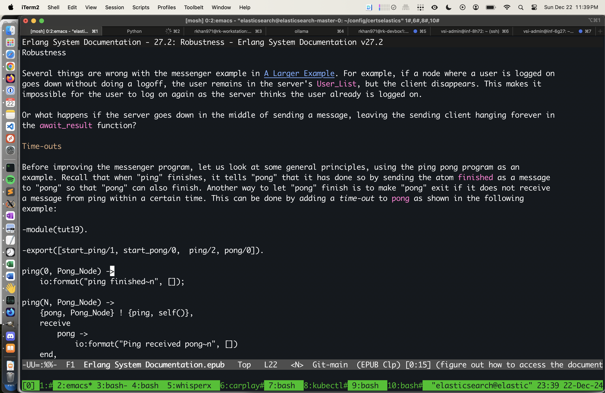
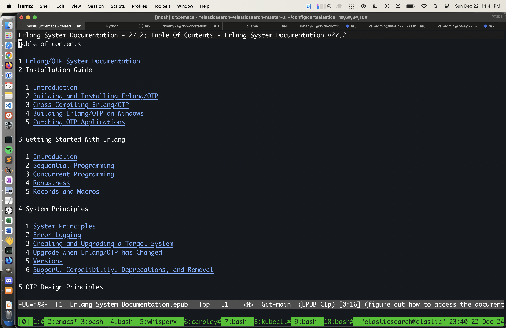

# Erlang System Documentation Epub

- A mirror under vcs.

## Motivation
I do a lot of deep work. Its useful to be able to quickly search and index large amounts of documentation, for various materials in various formats. Sometimes I want to look at the source code of an erlang function, I can quickly grep the source code. Sometimes I want to read the reference manual for the language. I can open the epub from this repo, using [nov](https://depp.brause.cc/nov.el/) on emacs without losing context.

## Screenshots
Reading a specific chapter



Browsing the table of contents.


## Source
```sh
$ wget https://www.erlang.org/doc/system/Erlang%20System%20Documentation.epub
--2024-12-22 23:30:15--  https://www.erlang.org/doc/system/Erlang%20System%20Documentation.epub
Resolving www.erlang.org (www.erlang.org)... 34.234.106.80, 100.28.201.155, 2600:1f18:16e:df02::65, ...
Connecting to www.erlang.org (www.erlang.org)|34.234.106.80|:443... connected.
HTTP request sent, awaiting response... 200 OK
Length: 658493 (643K) [application/epub+zip]
Saving to: ‘Erlang System Documentation.epub’

Erlang System Documentation.epub 100%[==========================================================>] 643.06K  --.-KB/s    in 0.1s

2024-12-22 23:30:18 (4.82 MB/s) - ‘Erlang System Documentation.epub’ saved [658493/658493]
```